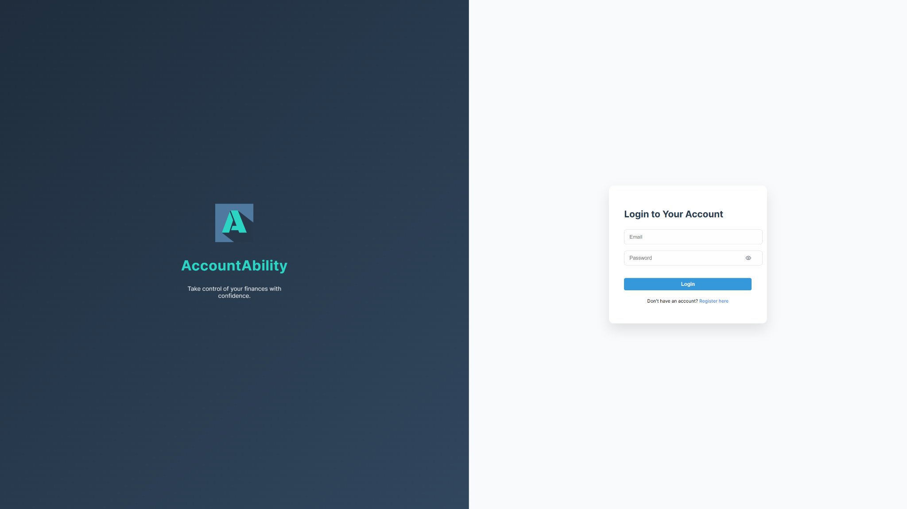
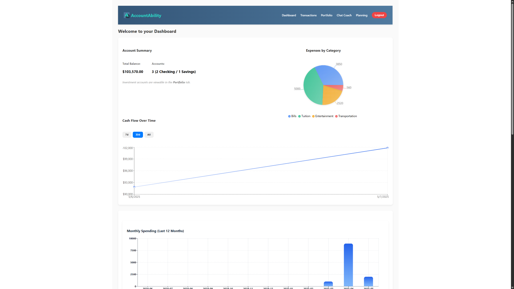
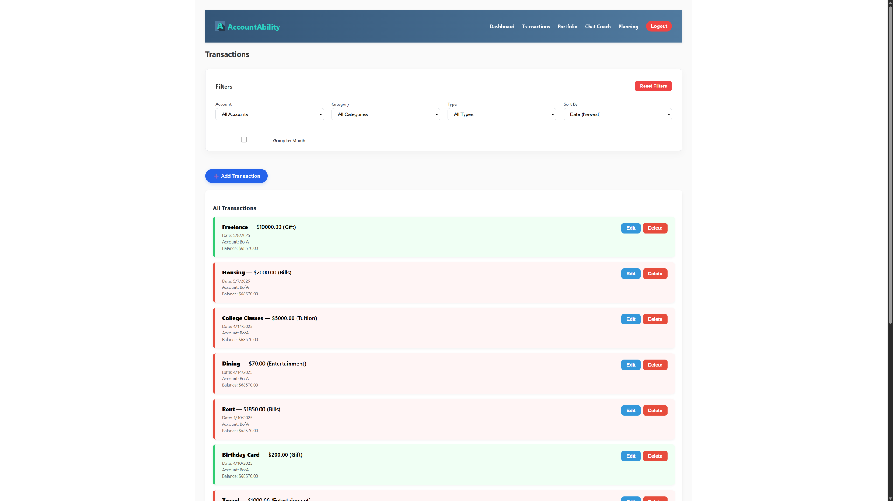
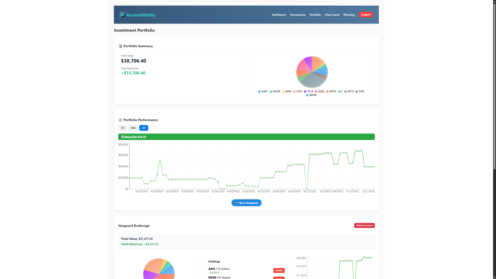
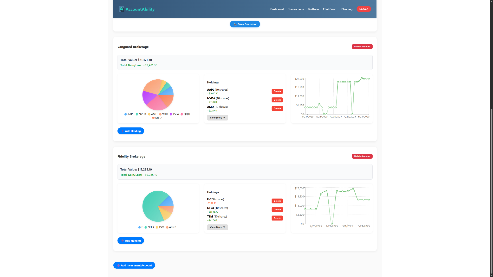
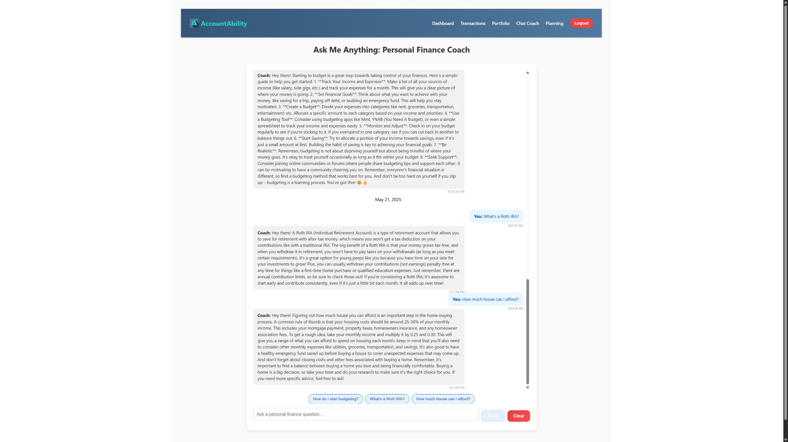
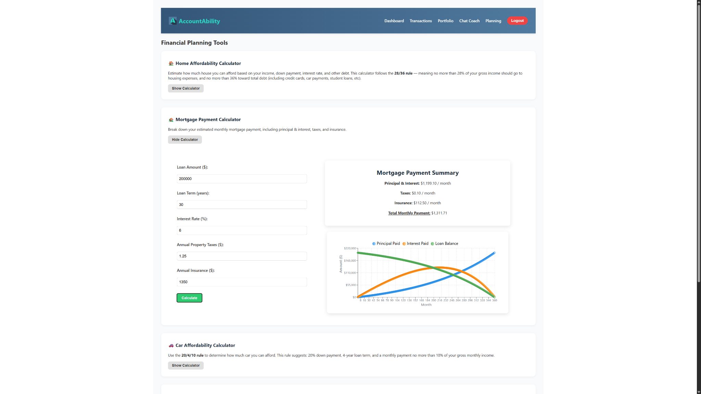

# 💰 AccountAbility

**AccountAbility** is a full-stack personal finance tracker built with the MERN stack. It empowers users to manage income, expenses, investment accounts, and cash flow with intuitive charts, clean UI, and financial tools that actually help.

> "AccountAbility" is about more than just tracking — it's about building clarity, confidence, and control over your financial life.

---

## 🌐 Live Demo

- **Frontend:** [https://accountability-finance.vercel.app](https://accountability-finance.vercel.app)
- **Backend API:** [https://accountability-backend.onrender.com](https://accountability-backend.onrender.com)

---

## 🚀 Key Features

### 🔐 Authentication

- Secure user login & registration using JWT tokens
- Protected routes via backend middleware

### 💳 Account Management

- Add, edit, and delete checking, savings, and investment accounts
- Real-time balance updates from transactions and holdings
- Account-specific performance and chart views

### 📒 Transactions

- Record income or expenses with category, description, and date
- Filter by account, category, or type
- Sort and paginate results
- Visual breakdowns of spending trends

### 📊 Dashboard

- Overview of total balances and gain/loss
- Pie chart: Spending by category
- Bar chart: Monthly spending trends
- Smart alerts for unusual spending behavior

### 📈 Investment Portfolio

- Add and track stock/ETF holdings per account
- Automatic valuation using live market data
- Portfolio summary and individual gain/loss
- Historical snapshots with mini performance charts

### 🧮 Planning Tools

- 💡 **New Calculators for:**
  - Mortgage & car affordability
  - Loan payment breakdowns
  - Budget planner using the 50/30/20 rule

### 🤖 AI Chat Coach

- ✅ **Completed:** Ask questions like “How do I start investing?” or “What’s a Roth IRA?”
- Built using OpenAI API for interactive financial literacy coaching
- Persistent UI with auto-scroll, timestamps, and bubble styling

---

## 🖼️ Screenshots

### 🔐 Login Page



### 📊 Dashboard Overview



### 📒 Transactions Tracker



### 📈 Portfolio Performance



### 📂 Expanded Holdings



### 🤖 AI Chat Coach



### 🧮 Financial Planning Tools



---

## 🛠️ Tech Stack

- **Frontend:** React, Axios, Recharts
- **Backend:** Node.js, Express.js
- **Database:** MongoDB Atlas + Mongoose
- **Authentication:** JWT
- **Deployment:** Vercel (frontend) + Render (backend)
- **Styling:** Responsive custom CSS

---

## ⚙️ Local Development

```bash
# Clone the repository
git clone https://github.com/victorvaladez1/accountability-finance.git
cd accountability-finance

# Start the backend
cd backend
npm install
npm run dev

# Start the frontend
cd ../frontend
npm install
npm start
```

> Runs locally on:
>
> - Frontend: `http://localhost:3000`
> - Backend: `http://localhost:5000`

---

## 📅 Roadmap

- [x] Account & transaction CRUD
- [x] Investment portfolio tracking
- [x] Dashboard analytics
- [x] Financial planning calculators
- [x] UI polish + responsive design
- [x] Deployed to Vercel & Render
- [x] AI ChatCoach with GPT integration

---

## 🙌 Inspiration

Created by someone passionate about software engineering and personal finance. Whether you're budgeting for groceries or building an investment portfolio, **AccountAbility** was made to make your money make sense.

> _"Knowing your numbers should be empowering — not overwhelming."_

---

## 👨‍💻 Author

Victor Valadez — [GitHub](https://github.com/victorvaladez1)
